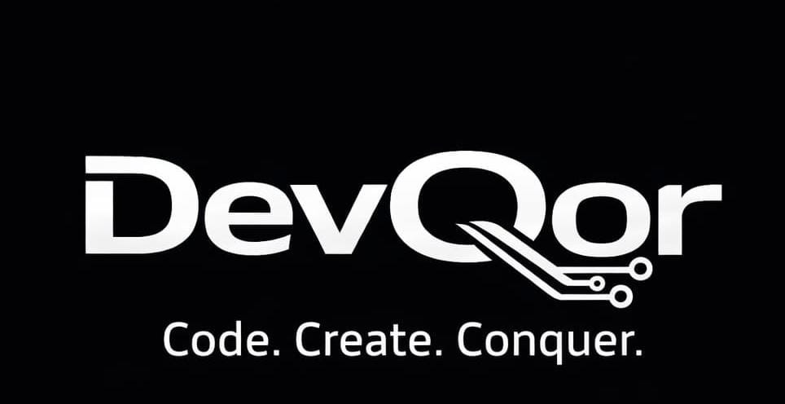

# DevQor

<div align="center">
  
  
  ### **Code. Create. Conquer.**
  
  *Transforming Ideas into Digital Excellence*
  
  ---
  
  [](/)
  [](/)
  [](/)
  [](/)
  
  [🌐 Website](https://devqor.in) • [📧 Contact Us](mailto:contact@devqor.in) • [📱 +91 9804804973](tel:+919804804973)
</div>

---

## 🏢 About DevQor

**DevQor** is a premier software development agency headquartered in **Kolkata, West Bengal, India**. We are a team of passionate engineers, designers, and innovators dedicated to delivering engineering excellence. Our mission is to transform businesses through cutting-edge technology solutions.

Since our founding in **2018**, we have grown from a small startup to a **global software development agency**, serving clients across **20+ countries worldwide**. We're recognized as a **"Top Software Development Agency"** and are proud certified partners with **AWS, Azure, and Google Cloud**.

### 🎯 Our Mission

> To empower businesses with world-class software solutions that drive growth, efficiency, and innovation. We believe great technology should be accessible to companies of all sizes.

### 🌟 Our Vision

> To become the most trusted software development partner globally, known for our unwavering commitment to quality, innovation, and client success.

---

## 💼 Our Services

We offer comprehensive software development services to help your business thrive in the digital landscape.

### 🚀 Full Stack Development
**End-to-End Solutions**

Comprehensive web and mobile application development from concept to deployment. We handle everything from database architecture to user interfaces.

- Custom Web Applications
- Mobile App Development (iOS & Android)
- Progressive Web Apps (PWA)
- API Development & Integration
- Database Design & Optimization
- Real-time Applications

**Technologies:** React, Node.js, Python, MongoDB, PostgreSQL, GraphQL

---

### � Frontend Development
**Stunning User Experiences**

Create beautiful, responsive, and performant user interfaces that engage and delight your users across all devices.

- Responsive Web Design
- Single Page Applications (SPA)
- Component Libraries
- Performance Optimization
- Accessibility (WCAG)
- Animation & Micro-interactions

**Technologies:** React, Vue.js, Angular, TypeScript, Tailwind, Framer Motion

---

### ⚙️ Backend Development
**Powerful & Scalable**

Build robust, secure, and scalable server-side solutions that power your applications and handle millions of requests.

- RESTful API Development
- Microservices Architecture
- Database Management
- Authentication & Security
- Message Queues & Workers
- Serverless Functions

**Technologies:** Node.js, Python, Java, Go, Redis, Kafka

---

### ☁️ Cloud Solutions & Deployment
**Scale Without Limits**

Leverage the power of cloud computing to deploy, scale, and manage your applications with enterprise-grade infrastructure.

- Cloud Architecture Design
- CI/CD Pipeline Setup
- Container Orchestration
- Infrastructure as Code
- Cost Optimization
- Multi-Cloud Strategy

**Technologies:** AWS, Azure, GCP, Docker, Kubernetes, Terraform

---

### 🔧 Maintenance & Support
**24/7 Peace of Mind**

Keep your applications running smoothly with our comprehensive maintenance and support services, available around the clock.

- 24/7 Monitoring & Alerts
- Bug Fixes & Updates
- Performance Optimization
- Security Patches
- Backup & Recovery
- SLA-Based Support

**Technologies:** Datadog, Grafana, PagerDuty, Sentry, New Relic, Prometheus

---

### 🎯 UI/UX Design
**Design That Converts**

Create intuitive, user-centered designs that solve real problems and deliver exceptional user experiences that drive conversions.

- User Research & Analysis
- Wireframing & Prototyping
- Visual Design Systems
- Usability Testing
- Interaction Design
- Design Handoff

**Technologies:** Figma, Sketch, Adobe XD, Principle, Zeplin, Miro

---

### ⚡ Digital Transformation
**Future-Ready Business**

Modernize your business processes and technology stack to stay competitive in the digital age and drive innovation.

- Technology Assessment
- Legacy System Modernization
- Process Automation
- Data Analytics & BI
- Change Management
- Digital Strategy Consulting

**Technologies:** AI/ML, RPA, IoT, Blockchain, Big Data, Analytics

---

## 🔄 Our Process

We follow a proven methodology for delivering successful projects:

| Step | Phase | Description |
|------|-------|-------------|
| **01** | 🔍 **Discovery** | We dive deep into your requirements, goals, and challenges to understand your vision. |
| **02** | 📋 **Planning** | We create a detailed roadmap, architecture, and project plan tailored to your needs. |
| **03** | 💻 **Development** | Our expert team brings your vision to life using agile methodologies. |
| **04** | 🚀 **Delivery** | We deploy, test, and ensure everything works perfectly before handoff. |

---

## 💎 Our Core Values

<table>
<tr>
<td align="center" width="25%">

### 🎯 Excellence
We deliver nothing but the best. Every line of code, every pixel, every solution is crafted with precision and care.

</td>
<td align="center" width="25%">

### 🤝 Collaboration
We work as partners, not vendors. Your success is our success, and we build lasting relationships.

</td>
<td align="center" width="25%">

### � Innovation
We stay ahead of the curve, constantly learning and implementing cutting-edge technologies.

</td>
<td align="center" width="25%">

### 🔒 Integrity
Transparency and honesty guide everything we do. We communicate openly and deliver on our promises.

</td>
</tr>
</table>

---

## 📈 Our Journey

```
2018 ──────── Founded
              Started with a vision to revolutionize software development outsourcing.
              
2019 ──────── First Major Client
              Secured our first enterprise client and delivered a transformative solution.
              
2020 ──────── Team Expansion
              Grew to 15 talented engineers and opened our first overseas office.
              
2021 ──────── Cloud Expertise
              Became certified partners with AWS, Azure, and Google Cloud.
              
2022 ──────── Industry Recognition
              Named "Top Software Development Agency" by Tech Review.
              
2023 ──────── Global Reach
              Expanded to serve clients across 20+ countries worldwide.
```

---

## 👥 Leadership Team

<table>
<tr>
<td align="center" width="25%">
<h3>👨‍💼 Alex Johnson</h3>
<b>Founder & CEO</b>
<br/><br/>
Visionary leader with 15+ years in software engineering
</td>
<td align="center" width="25%">
<h3>👩‍💻 Sarah Chen</h3>
<b>CTO</b>
<br/><br/>
Full stack expert driving technical innovation
</td>
<td align="center" width="25%">
<h3>👨‍🎨 Michael Park</h3>
<b>Lead Designer</b>
<br/><br/>
Award-winning UI/UX designer and creative director
</td>
<td align="center" width="25%">
<h3>👩‍🔬 Emily Rodriguez</h3>
<b>Engineering Lead</b>
<br/><br/>
Architecting scalable solutions for enterprise clients
</td>
</tr>
</table>

---

## 🏠 Our Culture

At DevQor, we believe in creating an environment where innovation thrives. We foster a culture of continuous learning, collaboration, and work-life balance. Our team is our greatest asset, and we invest in their growth and well-being.

<table>
<tr>
<td align="center" width="25%">

### 📚
**Continuous Learning**

Regular training, workshops, and learning opportunities

</td>
<td align="center" width="25%">

### 🏠
**Remote-First**

Flexible work arrangements for better work-life balance

</td>
<td align="center" width="25%">

### 🎮
**Fun Activities**

Team building events, hackathons, and celebrations

</td>
<td align="center" width="25%">

### 💪
**Health & Wellness**

Mental health support and wellness programs

</td>
</tr>
</table>

---

## � Why Choose DevQor?

| Benefit | Description |
|---------|-------------|
| ✅ **Experienced Team** | 10+ years of combined experience in software development |
| ✅ **Proven Track Record** | 150+ projects delivered successfully |
| ✅ **Global Presence** | Serving clients across 20+ countries |
| ✅ **Cloud Certified** | AWS, Azure, and Google Cloud partners |
| ✅ **24/7 Support** | Round-the-clock maintenance and support |
| ✅ **Agile Methodology** | Flexible, iterative development approach |
| ✅ **Quality Assured** | 99% client satisfaction rate |
| ✅ **Competitive Pricing** | Premium quality at competitive rates |

---

## 📞 Get In Touch

Ready to start your next project? We'd love to hear from you!

<table>
<tr>
<td width="33%" align="center">

### 📧 Email
**contact@devqor.in**

</td>
<td width="33%" align="center">

### 📱 Phone
**+91 9804804973**

</td>
<td width="33%" align="center">

### 📍 Location
**Kolkata, West Bengal, India**

</td>
</tr>
</table>

### 🕐 Office Hours

- **Monday - Friday:** 9:00 AM - 6:00 PM (IST)
- **Weekend:** By appointment only

---

## 🔗 Connect With Us

<div align="center">

[](https://linkedin.com/company/devqor)
[](https://twitter.com/devqor)
[](https://github.com/devqor)
[](https://devqor.in)

</div>

---

## 💼 Start Your Project

<div align="center">

### Ready to Build Something Amazing?

Let's discuss your project and create a solution that exceeds your expectations.

[](mailto:contact@devqor.in?subject=Project%20Inquiry)

</div>

---

<div align="center">
  
  **DevQor** - *Code. Create. Conquer.*
  
  © 2018-2026 DevQor. All rights reserved.
  
  Made with ❤️ in Kolkata, India
  
</div>
